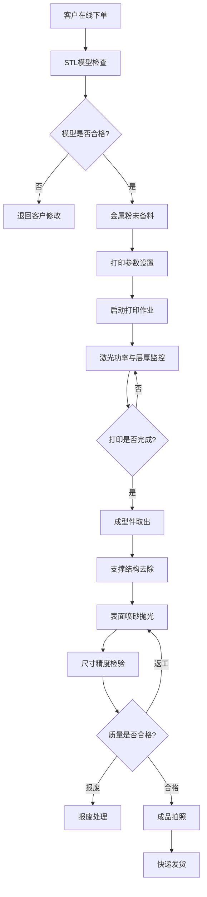

## 1. 产品概述

金属3D打印服务工厂管理APP，面向金属3D打印服务商，提供从客户下单到成品发货的全流程数字化管理。解决传统金属打印工厂订单混乱、工艺参数无记录、质量追溯困难等核心痛点。

- 目标用户：金属3D打印服务商的运营管理人员、工艺工程师、生产操作员
- 市场价值：实现金属打印全链路数字化管控，提升订单交付效率30%+，降低质量缺陷率

## 2. 核心功能

### 2.1 用户角色

| 角色 | 注册方式 | 核心权限 |
|------|----------|----------|
| 客户 | 在线注册 | 下单、查看订单进度、确认收货 |
| 操作员 | 管理员分配 | 处理打印作业、支撑去除、后处理、发货 |
| 工艺工程师 | 管理员分配 | 模型检查、参数设置、质量检验 |
| 管理员 | 系统预设 | 全部权限，含订单管理、人员管理、数据统计 |

### 2.2 功能模块

1. **在线下单页面**：客户信息录入、STL模型上传、材料与工艺选择、报价估算、订单提交
2. **模型检查页面**：STL文件解析与3D预览、模型缺陷检测（非流形边、法线翻转、壁厚不足）、模型修复建议、检查报告生成
3. **材料备料页面**：金属粉末库存管理、粉末类型与批次追踪、备料任务分配、粉末使用记录
4. **打印作业页面**：打印参数设置（激光功率、扫描速度、层厚）、打印队列管理、实时打印监控、激光功率记录与偏差告警、打印层厚监控
5. **支撑去除页面**：支撑结构可视化标记、去除方式选择（线切割/酸溶/手工）、去除进度跟踪、残留检测
6. **表面后处理页面**：喷砂参数记录、抛光工艺选择、表面粗糙度测量、尺寸精度检验记录、质量判定
7. **成品发货页面**：成品拍照存档、尺寸精度终检、快递信息录入、发货单打印、物流追踪

### 2.3 页面详情

| 页面名称 | 模块名称 | 功能描述 |
|----------|----------|----------|
| 在线下单 | 客户信息表单 | 客户姓名、联系方式、公司信息录入 |
| 在线下单 | 模型上传区 | STL/OBJ文件拖拽上传，支持多文件 |
| 在线下单 | 材料选择 | 下拉选择金属粉末类型（316L不锈钢、钛合金Ti6Al4V、铝合金AlSi10Mg等） |
| 在线下单 | 工艺参数 | 选择打印工艺（SLM/DMLS/EBM），表面处理要求 |
| 在线下单 | 报价计算 | 根据模型体积、材料、工艺自动估算报价 |
| 在线下单 | 订单提交 | 确认信息后提交订单，生成订单号 |
| 模型检查 | 3D模型预览 | Three.js渲染STL模型，支持旋转/缩放/剖切 |
| 模型检查 | 缺陷检测 | 自动检测非流形边、法线翻转、壁厚不足、重叠面 |
| 模型检查 | 检查报告 | 生成模型检查报告，含缺陷列表与修复建议 |
| 材料备料 | 粉末库存列表 | 展示各金属粉末库存量、批次号、供应商 |
| 材料备料 | 备料任务 | 根据订单自动生成备料任务，分配操作员 |
| 材料备料 | 粉末领用 | 扫码/手动记录粉末领用，扣减库存 |
| 打印作业 | 参数设置面板 | 设置激光功率、扫描速度、层厚、扫描策略、支撑参数 |
| 打印作业 | 打印队列 | 展示待打印/打印中/已完成任务列表 |
| 打印作业 | 实时监控 | 当前层号、激光功率曲线、舱内温度、氧含量监控 |
| 打印作业 | 功率记录 | 激光功率实时记录，偏差超限告警 |
| 打印作业 | 层厚监控 | 每层厚度记录，偏差分析与趋势图 |
| 支撑去除 | 支撑标记 | 3D模型上标记支撑位置与类型 |
| 支撑去除 | 去除方式 | 选择线切割/酸溶/手工去除方式 |
| 支撑去除 | 进度跟踪 | 记录去除进度，拍照留存 |
| 表面后处理 | 喷砂记录 | 喷砂压力、介质类型、时间记录 |
| 表面后处理 | 抛光记录 | 抛光方式、粗糙度目标值、实际测量值 |
| 表面后处理 | 尺寸检验 | 关键尺寸测量记录，公差判定 |
| 表面后处理 | 质量判定 | 综合判定合格/返工/报废 |
| 成品发货 | 成品拍照 | 多角度拍照存档，关联订单 |
| 成品发货 | 终检记录 | 最终尺寸精度检验确认 |
| 成品发货 | 快递信息 | 选择快递公司、录入运单号 |
| 成品发货 | 发货单 | 生成发货单，支持打印 |
| 成品发货 | 物流追踪 | 查看物流状态，客户通知 |

## 3. 核心流程

客户在线提交订单并上传STL模型 → 工艺工程师对模型进行缺陷检查与3D预览 → 检查通过后操作员进行金属粉末备料 → 工程师设置打印参数并启动打印作业 → 打印过程中实时监控激光功率与层厚 → 打印完成后取出成型件 → 操作员去除支撑结构 → 进行表面喷砂抛光后处理 → 工艺工程师进行尺寸精度检验与质量判定 → 成品拍照存档并安排快递发货

## 4. 用户界面设计

### 4.1 设计风格

- **主色调**：深铁灰(#1A1D23) + 熔岩橙(#FF6B35)，体现金属工业质感与3D打印的高温特性
- **辅色调**：钢蓝(#4A90D9)用于信息提示，钛金(#C0A062)用于高端品质标识
- **背景色**：深色系(#0D0F13)主背景，卡片使用(#1E2128)
- **按钮风格**：圆角8px，主按钮熔岩橙渐变，次按钮钢蓝描边
- **字体**：标题使用 Rajdhani（科技工业风），正文使用 Noto Sans SC（中文适配）
- **布局风格**：左侧导航栏 + 右侧内容区，卡片式模块布局
- **图标风格**：线性图标，2px描边，熔岩橙/钢蓝双色系
- **动效**：模块加载时从下方渐入，数据卡片微动悬浮，3D模型区域流光效果

### 4.2 页面设计概览

| 页面名称 | 模块名称 | UI元素 |
|----------|----------|--------|
| 在线下单 | 客户信息表单 | 左右分栏布局，左侧表单区深色卡片，右侧模型预览3D区域 |
| 在线下单 | 模型上传区 | 虚线拖拽区域，上传后显示3D缩略图，进度条熔岩橙 |
| 在线下单 | 材料与工艺选择 | 下拉卡片选择器，选中项带熔岩橙描边高亮 |
| 在线下单 | 报价计算 | 底部固定栏，左侧报价明细，右侧提交按钮 |
| 模型检查 | 3D模型预览 | 全屏3D渲染区，底部工具栏（旋转/缩放/剖切/线框模式） |
| 模型检查 | 缺陷检测面板 | 右侧滑出面板，缺陷列表带颜色标记（红=严重/黄=警告/绿=通过） |
| 模型检查 | 检查报告 | 模态弹窗，表格+3D标注截图，导出PDF按钮 |
| 材料备料 | 粉末库存列表 | 表格布局，库存量用进度条表示，低于阈值红色警示 |
| 材料备料 | 备料任务 | 卡片列表，每张卡片含订单号、粉末类型、数量、状态标签 |
| 打印作业 | 参数设置面板 | 网格布局参数输入，参数组可折叠，数值输入带单位标注 |
| 打印作业 | 打印队列 | 看板视图（待打印/打印中/已完成三列），卡片可拖拽排序 |
| 打印作业 | 实时监控 | 大屏仪表盘风格，数字翻牌器显示关键指标，曲线图实时刷新 |
| 支撑去除 | 支撑标记 | 3D模型视图，支撑区域半透明橙色标记 |
| 支撑去除 | 去除方式选择 | 卡片式选择器，每种方式配图标与说明 |
| 表面后处理 | 喷砂抛光记录 | 表单+照片上传区，粗糙度数值动态仪表盘 |
| 表面后处理 | 尺寸检验 | 表格录入测量值，自动判定合格/超差，红绿标识 |
| 表面后处理 | 质量判定 | 大号判定按钮（合格/返工/报废），判定后不可撤回 |
| 成品发货 | 成品拍照 | 相机取景框UI，拍照后缩略图展示，支持重拍 |
| 成品发货 | 快递信息 | 表单录入，快递公司下拉选择，运单号扫码输入 |
| 成品发货 | 发货单 | A4纸样预览模态窗，打印按钮 |

### 4.3 响应式设计

- 桌面优先设计，最小宽度1280px完整体验
- 1024-1280px：侧边导航收缩为图标模式，内容区自适应
- 768-1024px：单列布局，导航切换为底部标签栏
- 移动端暂不支持，保持桌面工厂管理场景

### 4.4 3D场景指引

- 环境：深色工业风HDRI，微弱暖光环境光
- 灯光：主方向光模拟激光束（熔岩橙色调），辅助冷色补光
- 相机：默认45度等距视角，OrbitControls交互
- 模型渲染：金属PBR材质，支撑结构半透明橙色渲染
- 后处理：Bloom效果模拟激光光晕，AO增强模型深度感
- 性能预算：STL文件≤50MB，帧率≥30fps
