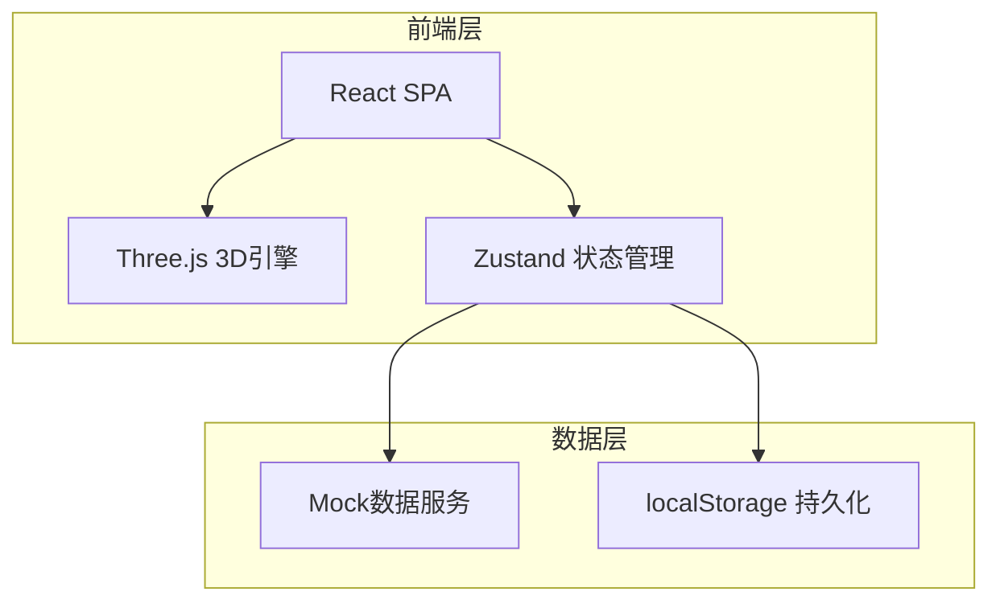
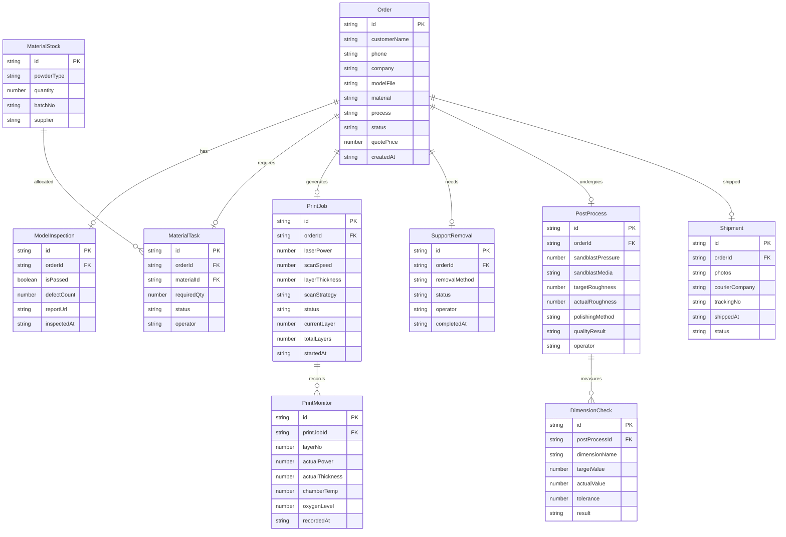

## 1. 架构设计

## 2. 技术说明

- 前端框架：React@18 + TypeScript + Vite
- 样式方案：TailwindCSS@3
- 3D渲染：Three.js + @react-three/fiber + @react-three/drei
- 状态管理：Zustand
- 路由方案：React Router@6
- 图表库：Recharts
- 图标库：Lucide React
- 数据方案：Mock数据 + localStorage持久化
- 初始化工具：Vite

## 3. 路由定义

| 路由 | 用途 |
|------|------|
| / | 仪表盘首页，展示订单概览与统计数据 |
| /order | 在线下单页面，客户信息与模型上传 |
| /inspection | 模型检查页面，STL预览与缺陷检测 |
| /material | 材料备料页面，粉末库存与备料任务 |
| /printing | 打印作业页面，参数设置与实时监控 |
| /support-removal | 支撑去除页面，支撑标记与去除跟踪 |
| /post-processing | 表面后处理页面，喷砂抛光与质量检验 |
| /shipping | 成品发货页面，拍照存档与快递发货 |

## 4. 数据模型

### 4.1 数据模型定义

### 4.2 数据定义

使用TypeScript接口定义数据结构，通过Zustand store管理状态，数据持久化至localStorage。核心实体包含订单、模型检查、材料库存、打印作业、监控记录、支撑去除、后处理、尺寸检验、发货信息等。
